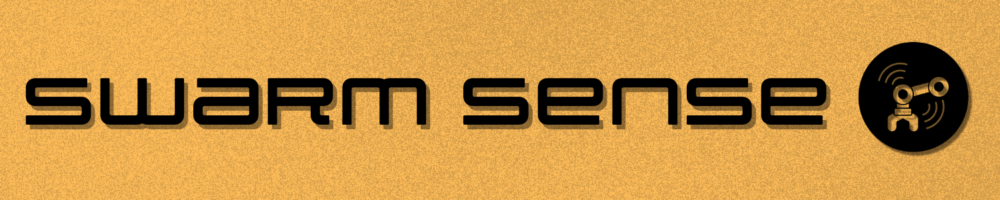

  

<h1 align= "center"> A Real-Time Multi-Robot Data Dashboard for the UTC Robotics Lab </h1>

### Project Members
Hussam Abubakr: Backend Developer

Jeana Chapman: Scrum Master & POC

Emiliano de la Garza: Full Stack Developer

Jewel Littlefield: DevOps Developer

Jack Sapp: Data Storage Developer

Hayla Turney: UI/UX Developer

### Project Sponsor:
Dr. Gokhan Erdemir

---

## Product Vision
**FOR** robotics research groups, autonomous system developers, and warehouse operators **WHO** are looking for ways to see all the data their machines are sensing in one central place. **THE** Swarm-Sense system is a centralized visualization platform **THAT** connects to robotics on a local network and synchronizes their sensor data (LiDAR, Vision, IMU, etc.) into a single, intuitive dashboard.

**UNLIKE** common visualization tools that center around a single sensor or proprietary software that is locked behind a specific brand, Swarm-Sense allows users to understand connect any robot regardless of manufacturer, visualize the sensor data in real-time in a low-latency system, and export this data for further behavior and anomalies analysis. 

Academic researchers and automated technology managers are the target customers for Swarm-Sense, as it will significantly facilitate monitoring and udnerstanding the data of multiple robots at the same time. It will provide "black box" recording capability for fleets increasing the efficiency with which failures in the robot and sensors can be solved. 

---

EMCS 214

Hiwonder JetAuto Robot Library
https://docs.hiwonder.com/projects/JetAuto/en/jetauto-orin-nano/

Hiwonder JetArm Robot Library
https://docs.hiwonder.com/projects/JetArm/en/jetarm-orin-nano/

Clearpath Jackal User Manual
https://docs.clearpathrobotics.com/docs_robots/outdoor_robots/jackal/user_manual_jackal/

Elephant Robotics myAGV Guide
https://cdn.shopify.com/s/files/1/0901/7976/4408/files/myAGV_PI_2023_EN.pdf?v=1757406598
